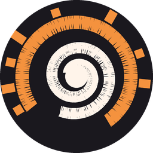

# Vigiles



> *Ubi fumus, ibi ignis* - where there is smoke, there is fire.

A Win32 C++ application that shows the folder tree of every local disk and
overlays live file-system activity captured from the kernel through ETW.

Written with heavily use of Claude AI but built and tested by a human.

The *vigiles urbani* were the night watch of ancient Rome, and they doubled as
its fire brigade: men who walked the city looking for things that were starting
to burn. This one walks a filesystem. Folders glow while they are busy, and the
motto is the workflow - you spot the smoke here, then go and find the fire.

Left pane: lazily populated folder tree. Each visible folder shows rolled-up
read/write counts and total bytes for its whole subtree, and gets a warm
background tint while it has been touched in the last three seconds.

Right pane: virtual list view of individual operations (time, op, PID, size,
path, process name), colour-coded by operation. Selecting a folder in the tree clears the list
and filters new rows to that subtree, so it is always a live view of one folder
rather than a log of the whole machine. Double-clicking a row walks the tree to
the folder that row lives in, expanding it on the way, and starts watching
there - which is how you follow activity from a file you noticed back to the
place it is coming from.

Bottom strip: a legend for the operation colours, and a **Copy AI prompt**
button (Ctrl+P).

Status bar: total events, current event rate, how full the in-process ring is,
how many detail rows were dropped, how many events the kernel dropped, and how
many were on handles that were never named.

## The AI prompt button

Watching a folder light up tells you *that* something is happening, not *what*
or *why*. The button collapses whatever is currently on screen into a compact
brief and puts it on the clipboard, ready to paste into any assistant.

Everything is aggregated into four rankings -
processes, subfolders, files and extensions - each line carrying a count, the
set of operation types seen on it, and total bytes. A sample of 805 operations
comes out at roughly 2.4 KB. See [sample-prompt.txt](sample-prompt.txt).

Two details that matter more than they look:

PIDs are resolved to image names through `OpenProcess` +
`QueryFullProcessImageNameW`, cached per PID. A process that has already exited
keeps its number as the label, so press the button while the activity is
happening.

Aggregation keys are case-folded. Windows reports the same file under different
spellings - the kernel emits both `\WINDOWS\SYSTEM32\` and `\Windows\System32\`,
sometimes within the same second - and without folding, one real file splits
into several rows and the counts that the whole brief rests on are wrong.

The prompt ends with four questions: what causes the activity, whether it is
normal, how to stop or reconfigure it, and a request to search the web for
current information about the processes and paths involved.

## Why ETW and not a custom driver

Process Monitor uses its own file-system minifilter. You *can* do that, but it
means writing a kernel driver, getting an EV cert plus Microsoft attestation
signing for it to load on a normal machine, and shipping a service to install
it. Every bug is a bugcheck.

The `Microsoft-Windows-Kernel-File` ETW provider gives you the same events
(create, read, write, delete, rename, set-info, cleanup, close, directory
enumeration) from user mode, with no driver at all. The only requirement is an
elevated process. Unless you need to *block* or *modify* I/O, this is the right
layer.

## Build

Requires Visual Studio 2019+ (or the Build Tools) and the Windows SDK.

```
cmake -B build -A x64
cmake --build build --config Release
```

The manifest marks the exe `requireAdministrator`, so it will prompt for
elevation on launch. Without elevation `StartTrace` fails with
`ERROR_ACCESS_DENIED` and the app runs with the tree only.

Administrator is not strictly required: starting an ETW session needs
membership of **Administrators** or of **Performance Log Users**. The latter is
not filtered by UAC, so a member gets the privilege in their ordinary token:

```
net localgroup "Performance Log Users" %USERNAME% /add
```

Sign out and back in, then change the linker flag in `CMakeLists.txt` from
`requireAdministrator` to `asInvoker`. There is no unprivileged path to
system-wide file activity - observing what every process touches is privileged
by design.

## How it works

**Session.** `StartTraceW` creates a private real-time session named
`Vigiles`, then `EnableTraceEx2` enables the Kernel-File provider with
the FILENAME, FILEIO, CREATE, READ, WRITE, DELETE_PATH, RENAME_SETLINK_PATH and
CREATE_NEW_FILE keywords. A `CAPTURE_STATE` call asks the provider to replay its
current name table, so handles that were already open before we started can
still be resolved. The session is stopped-if-stale on startup, because an ETW
session outlives the process that created it.

**Buffering.** This is the part your question was really about. There are two
separate buffers and they fail differently:

1. *Kernel buffers*, configured in `EtwConfig`: 512 buffers of 64 KB = 32 MB.
   If the consumer thread falls behind for longer than that, the kernel drops
   events and reports the count through the buffer callback — shown as
   "Kernel lost" in the status bar. Raise `maxBuffers` if you ever see it move.
   `FlushTimer = 1` keeps latency at about a second when the system is idle.

2. *In-process ring*, 1M records of 32 bytes = 32 MB. Paths are interned to an
   integer id so records stay small and the ring can hold a lot of history.
   The ring is drop-oldest and only feeds the scrolling detail list.

The important design decision: **aggregation happens on the ETW thread, before
the ring**. Per-folder counters are therefore exact even under a storm where
the detail list drops rows. The alternative — aggregating on the UI thread
after draining — makes your folder totals wrong exactly when the disk is
busiest.

**Path resolution.** Read and write events carry only a `FileObject` pointer
and a `FileKey`, not a path. Create/CreateNewFile and the NameCreate rundown
events carry the path, so the ETW thread maintains `FileObject -> name` and
`FileKey -> name` maps and evicts on Close. Names arrive as
`\Device\HarddiskVolume3\...` and are translated to `C:\...` with a
`QueryDosDevice` map built at startup.

**Roll-up.** For each path, the ancestor chain (`C:\a\b` -> `C:\a` -> `C:\`) is
resolved once per interned name id and cached, so the hot path is a handful of
pointer increments under one mutex rather than repeated string hashing.

**Decoding.** Event ids for this provider shift between Windows versions, so
the op is derived from the TDH `TaskName` and cached per (event id, version)
rather than hard-coded. Properties are read by name with `TdhGetProperty`.

## Dev Drives report nothing

A [Dev Drive](https://learn.microsoft.com/en-us/windows/dev-drive/) is a ReFS
volume marked *trusted*, and the point of that flag is filter detachment:
Filter Manager turns off all minifilters on it except antivirus. That is where
its performance comes from.

File I/O ETW events are not produced by the file system or the I/O manager -
they are produced by a minifilter, `fileinfo.sys`
([Raymond Chen has the stack diagram](https://devblogs.microsoft.com/oldnewthing/20201125-00/?p=104480)).
Detach it and nothing generates `Microsoft-Windows-Kernel-File` events for that
volume, so this application sees exactly zero there. Process Monitor sees
nothing either, for the same reason.

You can re-attach it, at the cost of some of what the Dev Drive was buying you:

```
fsutil devdrv query D:
fsutil devdrv setfiltersallowed /f /volume D: "WdFilter, FileInfo"
```

`setFiltersAllowed` replaces the whole list rather than appending, so name every
filter you want in one command. `/f` forces a dismount so the change applies
immediately - close anything using the volume first.

## Known limitations and where to go next

- `TdhGetProperty` by name on every event is the convenient path, not the fast
  one. Around a few hundred thousand events/second it becomes the bottleneck.
  The fix is to resolve property offsets once per event descriptor with
  `TdhGetEventInformation` and then parse `UserData` directly.
- Adding the `OP_END` keyword (0x40) gives you completion status and latency
  per operation, at roughly double the event volume.
- Physical disk queue depth and per-disk throughput are *not* in Kernel-File.
  For that, add the `Microsoft-Windows-Kernel-Disk` provider in the same
  session and correlate on IRP pointer.
- Process names are resolved with `OpenProcess` +
  `QueryFullProcessImageNameW`, cached per PID, at the moment the event is
  captured rather than when it is displayed - a process that has already exited
  cannot be named, and resolving lazily at paint time would lose every
  short-lived one. Two gaps remain. A process that exits between the kernel
  event and the next UI tick still shows as a bare number, which
  `Microsoft-Windows-Kernel-Process` would fix by naming processes as they
  start. And Windows recycles PIDs, so under heavy process churn the cache can
  label a row with the previous tenant of that number; the fix there is the
  `PROCESS_START_KEY` in the event's extended data, which is unique and never
  reused. The session already enables it, it is simply not read yet.
- The tree does not watch for folders created or deleted after you expanded a
  node. `ReadDirectoryChangesW` on expanded nodes, or simply re-populating on
  collapse/expand, would cover it.
- Untested against a compiler on my side — I wrote this without a Windows
  toolchain available, so expect to fix a few signature or header nits on the
  first build.

## License

Copyright (C) 2026 Marco Borgna.

Vigiles is free software under the **GNU Lesser General Public License,
version 3 or later**. The full terms are in [COPYING.LESSER](license/COPYING.LESSER),
which applies on top of the GPL-3.0 text in [COPYING](license/COPYING) - LGPL-3.0 is
written as a set of additional permissions over the GPL, so both files are
needed for the licence to be complete.

In short: you may use, study, modify and redistribute this, including inside a
larger work that is not itself free software. What you may not do is ship a
modified version of *these files* without making those modifications available
under the same terms.
